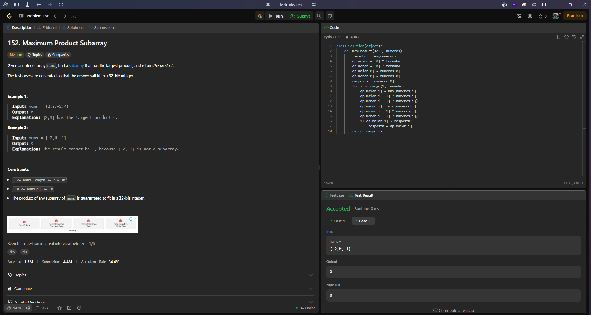
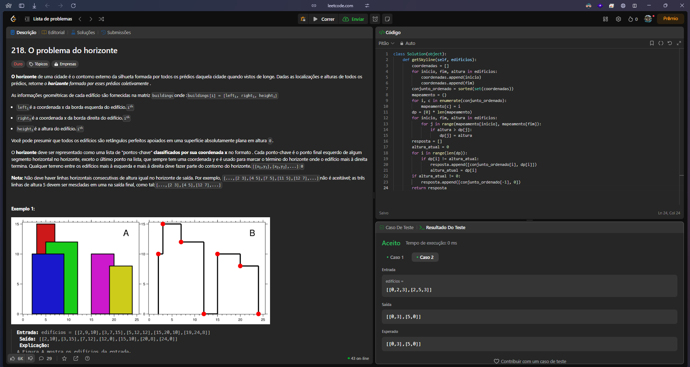

# PD_DesafiosLeetcode

**Conteúdo da Disciplina**: Programação Dinâmica 

## Alunos

| Matrícula  | Aluno                       |
| ---------- | --------------------------- |
| 21/1030809 | JULIO CESAR ALMEIDA DOURADO |

## Sobre

Meu projeto foi resolução de problemas do LeetCode.

## Link de apresentação no Youtube

[Clique aqui]()

## Screenshots do Projeto em Funcionamento

## Desafios

| NOME                                                                                                 | DIFICULDADE |
| ---------------------------------------------------------------------------------------------------- | ----------- |
| [152. Maximum Product Subarray](https://leetcode.com/problems/maximum-product-subarray/description/) | MEDIUM      |
| [218. The Skyline Problem](https://leetcode.com/problems/the-skyline-problem/description/)           | HARD        |
|                                                                                                  |             |

Aqui estão algumas imagens do projeto em funcionamento:

#### Desafio 1 [152. Maximum Product Subarray (MEDIUM)](https://leetcode.com/problems/maximum-product-subarray/description/)

#### Desafio 2 [218. The Skyline Problem (HARD)](https://leetcode.com/problems/the-skyline-problem/description/)

#### Desafio 3 

## Modo de uso

versão do Python: 3.13.0

Para rodar o arquivo manualmente: 
`python nomeDoArquivo.py`
